# 🏗️ MARVIC 360 - Mapa Visual de Dependencias

Este diagrama representa el flujo de datos del sistema completo: desde la base de datos PostgreSQL (a través de Supabase) hasta la capa de interfaz de usuario (React). Muestra cómo cada módulo de negocio depende de las capas intermedias (hooks, utilidades, componentes) para funcionar.

```mermaid
graph TD
    subgraph Pages["📄 Pages Layer (src/pages/)"]
        PersonalPage["Personal.tsx"]
        MaquinariaPage["Maquinaria.tsx"]
        InventarioPage["Inventario.tsx"]
        InventarioUbiPage["InventarioUbicacion.tsx"]
        TrabajosPage["Trabajos.tsx"]
        ParteDiarioPage["ParteDiario.tsx"]
        LogisticaPage["Logistica.tsx"]
        ExportarPDFPage["ExportarPDF.tsx"]
        FarmMapPage["FarmMap.tsx"]
        DashboardPage["Dashboard.tsx"]
    end

    subgraph Hooks["⚙️ Hooks Layer (src/hooks/)"]
        usePersonal["usePersonal.ts<br/>(343 lines)"]
        useMaquinaria["useMaquinaria.ts<br/>(435 lines)"]
        useInventario["useInventario.ts<br/>(742 lines)"]
        useTrabajos["useTrabajos.ts<br/>(590 lines)"]
        useParteDiario["useParteDiario.ts<br/>(564 lines)"]
        useParcelData["useParcelData.ts<br/>(786 lines) 🔴"]
        useLogistica["useLogistica.ts<br/>(613 lines)"]
        useGeoJSON["useGeoJSON.ts"]
    end

    subgraph Utils["🔧 Utilities (src/utils/)"]
        pdfUtils["pdfUtils.ts 🔴<br/>(PDF_COLORS, initPdf)<br/>(generarPDFCorporativoBase)"]
        dateFormat["dateFormat.ts"]
        uploadImage["uploadImage.ts"]
        validation["validation.ts"]
    end

    subgraph Components["🎨 Components (src/components/)"]
        SelectWithOther["SelectWithOther.tsx 🔴"]
        AudioInput["AudioInput.tsx 🔴"]
        PhotoAttachment["PhotoAttachment.tsx 🔴"]
        RecordActions["RecordActions.tsx 🔴"]
        AppLayout["AppLayout.tsx"]
        GlobalSidebar["GlobalSidebar.tsx"]
    end

    subgraph Data["🗄️ Data Layer (src/integrations/supabase/)"]
        SupabaseClient["client.ts 🔴<br/>(Primary Hub)"]
        SupabaseTypes["types.ts 🔴<br/>(Type Definitions)"]
    end

    subgraph Constants["⚡ Constants (src/constants/)"]
        farms["farms.ts<br/>(FINCAS_DATA)"]
        tiposTrabajo["tiposTrabajo.ts"]
        navItems["navItems.ts"]
    end

    %% PRIMARY BUSINESS FLOW: Personal → Maquinaria → Inventario → Trabajos → PDF Export

    %% Personal Module Chain
    PersonalPage -->|imports| usePersonal
    usePersonal -->|queries| SupabaseClient
    usePersonal -->|types| SupabaseTypes
    PersonalPage -->|UI| SelectWithOther
    PersonalPage -->|UI| AudioInput
    PersonalPage -->|UI| PhotoAttachment
    PersonalPage -->|UI| RecordActions
    PersonalPage -->|PDF| pdfUtils

    %% Maquinaria Module Chain
    MaquinariaPage -->|imports| useMaquinaria
    MaquinariaPage -->|imports| usePersonal
    MaquinariaPage -->|imports| useInventario
    useMaquinaria -->|queries| SupabaseClient
    useMaquinaria -->|types| SupabaseTypes
    MaquinariaPage -->|UI| SelectWithOther
    MaquinariaPage -->|UI| AudioInput
    MaquinariaPage -->|UI| PhotoAttachment
    MaquinariaPage -->|UI| RecordActions
    MaquinariaPage -->|PDF| pdfUtils

    %% Inventario Module Chain
    InventarioPage -->|imports| useInventario
    InventarioPage -->|imports| usePersonal
    InventarioUbiPage -->|imports| useInventario
    InventarioUbiPage -->|imports| usePersonal
    useInventario -->|queries| SupabaseClient
    useInventario -->|types| SupabaseTypes
    InventarioPage -->|UI| SelectWithOther
    InventarioPage -->|UI| AudioInput
    InventarioPage -->|UI| PhotoAttachment
    InventarioPage -->|UI| RecordActions
    InventarioPage -->|PDF| pdfUtils

    %% Trabajos Module Chain (Most Complex)
    TrabajosPage -->|imports| useTrabajos
    TrabajosPage -->|imports| useParcelData
    TrabajosPage -->|imports| usePersonal
    TrabajosPage -->|imports| useMaquinaria
    TrabajosPage -->|imports| useInventario
    useTrabajos -->|queries| SupabaseClient
    useTrabajos -->|types| SupabaseTypes
    useParcelData -->|queries| SupabaseClient
    useParcelData -->|types| SupabaseTypes
    TrabajosPage -->|UI| SelectWithOther
    TrabajosPage -->|UI| AudioInput
    TrabajosPage -->|UI| PhotoAttachment
    TrabajosPage -->|UI| RecordActions
    TrabajosPage -->|PDF| pdfUtils

    %% ParteDiario Module Chain
    ParteDiarioPage -->|imports| useParteDiario
    useParteDiario -->|queries| SupabaseClient
    useParteDiario -->|types| SupabaseTypes
    ParteDiarioPage -->|UI| SelectWithOther
    ParteDiarioPage -->|UI| AudioInput
    ParteDiarioPage -->|UI| PhotoAttachment
    ParteDiarioPage -->|UI| RecordActions
    ParteDiarioPage -->|PDF| pdfUtils

    %% Logistica Module Chain
    LogisticaPage -->|imports| useLogistica
    LogisticaPage -->|imports| usePersonal
    useLogistica -->|queries| SupabaseClient
    useLogistica -->|types| SupabaseTypes
    LogisticaPage -->|UI| SelectWithOther
    LogisticaPage -->|UI| AudioInput
    LogisticaPage -->|UI| PhotoAttachment
    LogisticaPage -->|UI| RecordActions
    LogisticaPage -->|PDF| pdfUtils

    %% PDF Export Central Hub
    ExportarPDFPage -->|direct queries| SupabaseClient
    ExportarPDFPage -->|types| SupabaseTypes
    ExportarPDFPage -->|PDF generation| pdfUtils

    %% Field/Map Chain
    FarmMapPage -->|imports| useGeoJSON
    FarmMapPage -->|imports| useParcelData
    useGeoJSON -->|queries| SupabaseClient
    FarmMapPage -->|PDF| pdfUtils

    %% Dashboard (lightweight)
    DashboardPage -->|layout| AppLayout

    %% Shared utilities used across
    pdfUtils -->|dependency| uploadImage
    pdfUtils -->|dependency| dateFormat
    PersonalPage -->|utilities| uploadImage
    MaquinariaPage -->|utilities| uploadImage
    InventarioPage -->|utilities| uploadImage
    TrabajosPage -->|utilities| uploadImage
    ParteDiarioPage -->|utilities| uploadImage

    %% Constants access
    PersonalPage -->|constants| farms
    MaquinariaPage -->|constants| farms
    TrabajosPage -->|constants| farms
    TrabajosPage -->|constants| tiposTrabajo
    ParteDiarioPage -->|constants| farms

    %% Layout wrapping
    PersonalPage -->|wrapped| AppLayout
    MaquinariaPage -->|wrapped| AppLayout
    InventarioPage -->|wrapped| AppLayout
    TrabajosPage -->|wrapped| AppLayout
    ParteDiarioPage -->|wrapped| AppLayout
    LogisticaPage -->|wrapped| AppLayout
    ExportarPDFPage -->|wrapped| AppLayout

    %% Styling for Central Hubs
    style SupabaseClient fill:#ff6b6b,stroke:#c92a2a,stroke-width:3px,color:#fff
    style SupabaseTypes fill:#ff6b6b,stroke:#c92a2a,stroke-width:3px,color:#fff
    style pdfUtils fill:#ff6b6b,stroke:#c92a2a,stroke-width:3px,color:#fff
    style SelectWithOther fill:#ff6b6b,stroke:#c92a2a,stroke-width:2px,color:#fff
    style AudioInput fill:#ff6b6b,stroke:#c92a2a,stroke-width:2px,color:#fff
    style PhotoAttachment fill:#ff6b6b,stroke:#c92a2a,stroke-width:2px,color:#fff
    style RecordActions fill:#ff6b6b,stroke:#c92a2a,stroke-width:2px,color:#fff
    style useParcelData fill:#ffa94d,stroke:#e67700,stroke-width:2px,color:#000

    %% Subgraph colors
    style Pages fill:#e7f5ff,stroke:#1971c2,stroke-width:2px
    style Hooks fill:#f0f9ff,stroke:#0284c7,stroke-width:2px
    style Utils fill:#f3f0ff,stroke:#7c3aed,stroke-width:2px
    style Components fill:#fce7f3,stroke:#be185d,stroke-width:2px
    style Data fill:#fee2e2,stroke:#991b1b,stroke-width:3px
    style Constants fill:#f0fdf4,stroke:#15803d,stroke-width:2px
```



---

### 🎨 Leyenda de Colores

| Color | Categoría | Descripción |
|-------|-----------|-------------|
| 🔴 **Rojo** | **Núcleos Críticos** | Si fallan, el sistema cae. Incluye: `supabase/client.ts`, `pdfUtils.ts`, componentes base (`SelectWithOther`, `AudioInput`, `PhotoAttachment`, `RecordActions`). Requieren máxima estabilidad y testing. |
| 🔵 **Azul** | **Páginas de Usuario** | Componentes principales que representan las pantallas del ERP. Cada página depende de múltiples hooks y componentes base. |
| 🔷 **Celeste** | **Lógica de Negocio (Hooks)** | Capas intermedias que encapsulan queries a Supabase y transforman datos. Contienen ~4,300 líneas de código reutilizable. |
| 🟠 **Naranja** | **Módulos Complejos** | `useParcelData.ts` (786 líneas): Hook de máxima complejidad que gestiona datos de parcelas, cultivos, cosechas y residuos. Requiere refactorización en sub-hooks. |
| 🟣 **Púrpura** | **Utilidades** | Funciones puras reutilizables: `pdfUtils.ts`, `dateFormat.ts`, `uploadImage.ts`, `validation.ts`. |
| 🟩 **Verde** | **Constantes** | Datos estáticos centralizados: fincas, tipos de trabajo, estados, elementos de navegación. |

---

### 📊 Estadísticas del Sistema

| Métrica | Valor |
|---------|-------|
| **Número de Páginas** | 10 componentes principales |
| **Número de Hooks** | 9 archivos de lógica personalizada |
| **Líneas en Hooks** | ~4,300 líneas totales |
| **Componentes Base Reutilizables** | 4 (SelectWithOther, AudioInput, PhotoAttachment, RecordActions) |
| **Profundidad Máxima de Dependencias** | 5 capas (Page → Hook → Client → Supabase → DB) |
| **Módulo Más Complejo** | `Trabajos.tsx` (importa 4 hooks + todos los componentes base) |
| **Hook Más Grande** | `useParcelData.ts` (786 líneas) |

---

### 🚨 Cadenas de Dependencia Críticas

#### **Cadena 1: Acceso a Datos (CRÍTICA)**
```
Todas las páginas de negocio 
  → Hooks (usePersonal, useMaquinaria, useInventario, useTrabajos)
  → supabase/client.ts
  → PostgreSQL
```
- **Riesgo**: Punto de fallo único en `supabase/client.ts` rompe la capa de datos en 15+ páginas
- **Impacto**: ~4,300 líneas de lógica de hooks dependen de este cliente
- **Mitigación**: Pooling de conexiones robusto, manejo de errores, queries de fallback

#### **Cadena 2: Generación de PDF (CRÍTICA)**
```
Módulos de negocio (Personal, Maquinaria, Inventario, Trabajos, ParteDiario, ExportarPDF)
  → pdfUtils.ts (initPdf, generarPDFCorporativoBase)
  → jsPDF
```
- **Riesgo**: Cambios en `pdfUtils.ts` afectan 6+ módulos simultáneamente
- **Características**: Branding corporativo centralizado, headers/footers en múltiples páginas
- **Mitigación**: Tests unitarios exhaustivos + versionado estricto de jsPDF

#### **Cadena 3: Componentes UI (ESTRUCTURAL)**
```
Todas las páginas de negocio 
  → components/base/ (SelectWithOther, AudioInput, PhotoAttachment, RecordActions)
  → React + Tailwind
```
- **Riesgo**: Inconsistencias en cambios = UX degradada en 5+ módulos
- **Cobertura**: ~150+ campos de formulario, uploads de media, operaciones CRUD
- **Mitigación**: Compatibilidad hacia atrás garantizada + validación de props

---

### 🎯 Recomendaciones Arquitectónicas

1. **Refactorizar `useParcelData.ts`**: Dividir en sub-hooks especializados (useParcelas, usePlantings, useHarvests, useResiduos)
2. **Tests para núcleos críticos**: Cobertura >95% en `supabase/client.ts` y `pdfUtils.ts`
3. **Documentación de API**: Mantener contrato de tipos entre componentes y hooks
4. **Monitoreo de cambios**: CI/CD que valide compatibilidad en cambios a hooks o utilidades base
5. **Deprecación controlada**: Usar TypeScript `@deprecated` para cambios graduales en componentes base

---

**Versión del Documento**: Rev. 1.0 | **Fecha**: Abril 2026 | **Proyecto**: Agrícola Marvic 360 ERP
